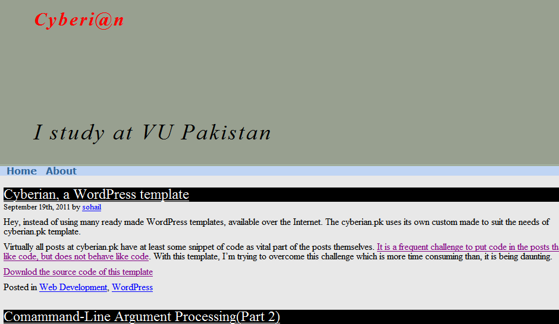

Cyberian
===========
A WordPress theme for blogs. Written by, Sohail Qayum Malik

In order to learn how the WordPress themes work and how they fit into the whole framework provided by the WordPress, I went through the process of writing this theme. I liked the whole experience and I still reminisce about the days when I was working on this project. Though this repository/theme is here for the documentation purposes but even then, I would love to see the codebase of this theme gets increased in terms of more functionality and more maturity in delivery and presentation of content/pages. 

(http://github.com/sohail)

